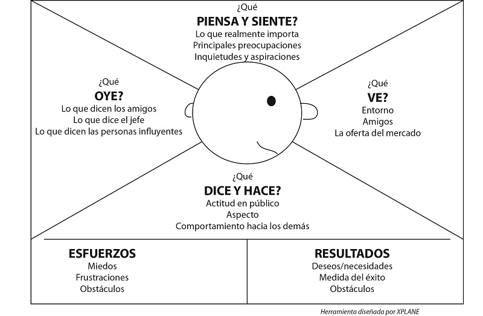

# clase 3
20-agosto

## conozcamos al cliente

herramientas útiles para conocer los clientes

labor investigativa:
- redes sociales
- seguimiento de ventas
- investigar canales de comunicación y ventas de la empresa

## business model canvas

A continuación las definiciones, en orden de cómo se rellena al investigar una empresa. De igual manera, al iniciar un nuevo negocio, este es el orden recomendado para rellenarlo.

### segmento de clientes: 

cada empresa tiene su segmento, y puede tener más de uno.

preguntas que debemos respondernos,
- ¿dirijirnos al público general o segmentar?
- ¿quiénes son los clientes de la empresa, a quién se dirige?
- ¿qué segmentos podemos identificar?
- ¿qué segmentos son prioritarios?
- ¿qué necesitan estos clientes?

### propuesta de valor:

aquello que diferencia a la empresa de otras empresas similares. O aquello que agrega valor a la empresa.

### relación con los clientes:

cómo la empresa trata y se dirige hacia sus clientes. ¿cómo le comunico lo que estoy haciendo?

### canales de comunicación y distribución:

definir canales: páginas web, mercado libre, rrss, counicación directa, starken, etc.

### flujos de ingreso:

¿por qué me van a pagar mis clientes? un negocio puede tener múltiples flujos de ingreso.

usuario vs cliente: ejemplo, para los jueguetes, el usuario es el niñx, y el cliente es la mamá o quien se lo compró.

## mapa de empatía

herramienta visual que permite a la empresa, describir, diseñar, analizar y adapatar sus modelos de negocio.

busca entender a su usuario

se pueden hacer mapa de empatía por separado para cliente y usuario.

se puede incluir: cómo se viste, qué le gusta, con qué tipo de empresa le gusta trabajar, etc. 

¿qué oye en su entorno respecto a la empresa?

