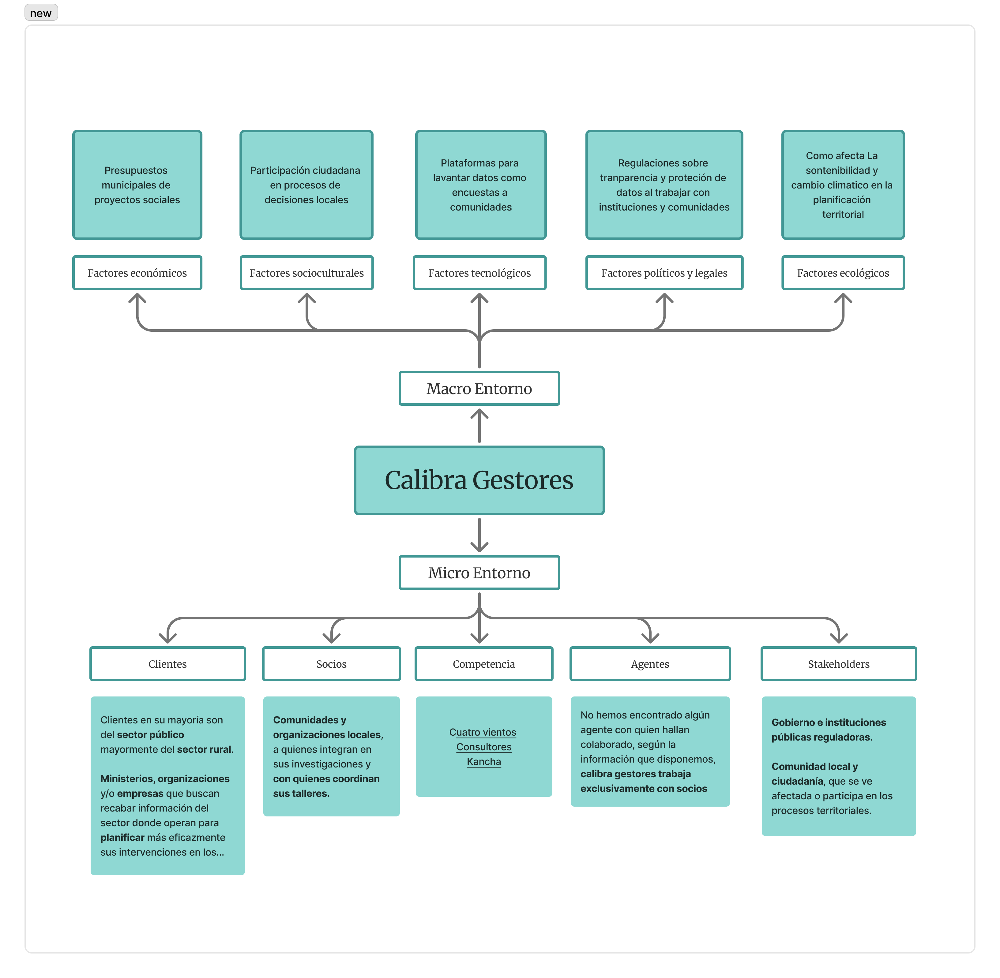

# clase 2
13-agosto

## presentación proyectos a elegir

- [Ropa de Género(RDG)](https://www.ropadegenero.cl) - Eugenia Ibarra Letelier

- [La Vida en Lavanda](https://www.lavidaenlavanda.cl) - Isidora Labarthe

- [Drai Beachwear](https://www.instagram.com/drai.beachwear/?hl=en)

- [Calibra Gestores](https://calibragestores.cl)

- [La Brava](https://www.instagram.com/labravacl)

- [Zurda](https://www.zurda.cl) - María Paz Cuadra

- [Rita Conservas](https://ritaconservas.cl)

- [Terrarios Carungen](https://terrarioskarungen.cl)

### presentación

proceso a seguir con la pyme

1. Análisis de micro y macro entorno: saber los factores clave que afectan a operaciones empresariales actuales.

macro entorno: faftores más amplios, sobre los cuales la empresa no tiene ninguna incidencia directa.

#### Micro entorno:

lo más directamente relacionado ccon la empresa, elementos que afectan directamente en las operaciones del día a día de la empresa, ejemplo: clientes, proveedores, competencia, colaboradores, [stakeholders](https://en.wikipedia.org/wiki/Stakeholder_(corporate)), distribuidores, socios estratégicos, delivery's, etc.

Todos estos factores son "controlables"

##### Importancia para el éxito empresarial: 

El microentorno impacta el desmepeño operativo y la competitividad de la empresa en el mercado.

#### Macro entorno

abarca fuerzas externas amplias e incontrolables, como factores políticos, económicos y sociales.

ejemplo: Guerra, funas, políticas públicas, factores medioambientales, tecnológicos, etc.

PESTEL: Political, Economical, Social, Technological, Enviromental, Legal.

##### impacto directo del microentorno

- disponibilidad de recursos: el microentorno determina la calidad y cantidad de recursos disponibles para la operación diaria de la empresa.

- satisfacción del cliente: afecta direcatamente en la reputación y éxito empresarial.

- competencia directa: las decisiones de competencias directas pueden requerir innovación y estrategias. Ejemplo: si tapsin empieza a sumar 2 paquetes gratis en el pack, va a afectar directamente a ENO.

competencia directa: tiene incidencia diracta en el exito de mi negocio

- gestión de proveedores: una gestión efectiva asegura el flujo constante de materiales y servicios esenciales.

### clientes

- comprension de necesidades: entenderlas es esencial para ofrecer soluciones

- preferencias del cliente: guían la eleccion de productos y serviicos, incidencia en satisfacción y fidelidad

- comportamiento del cliente: analizarlos permite anticipar y adaptar estrategias de mercado existosamente

### proveedores:

- socios estratégicos: aliados clave que suministran esenciales

- calidad: calidad de los insumos

- precios: 

- cumplimiento tiempos de entrega

### competencia: estrategias, posicionamiento y diferenciación

- contecto competitivo: los competidores definen el entorno donde la empresa actúa y compite

- estrategias de competidores: estudiar las estrategias de los competidores ayuda a identificar oportunidades para mejorar la posicion en el mercado

- posicionamiento y diferenciación: clave para destacar en el mercado y atraer clientes

### Intermedieros, distribuidores, minorista y agentes

rol de lo intermediarios: facilitan la conexion entre productores y consumidores

### stakeholders internos: empleados, socios y directivos

- empleados: base operativa que sostiene la cultura y productividad de la organización

- socios: aportan recursos y apoyo estratégico clave para el crecimiento empresarial

- directivos: guían la visión y toman desiciones que afectan el éxito organizacional

## macroentorno

diferencia principales:

lcance amplio:  abarca factores externos que afectan a multiples industrias a la vez

menor control empresarial: impredecible y desafiente

necesidad de análisis estratégico: analizar el macroentorno es esencial para anticipar cambios y adaptarse

### influencia macroentorno en la industria y país

contexto económico define condiciones ifnancieras que afectan a las industrias y el desarrollo nacional

conexto legal: leyes y regulaciones que influyen en la operacion de negcios

### factores principales macroentorno:

#### económicos: inflación, tasas de interés y poder adquisitivo

- Inflación y costo de capital

- Tasas de interés y financiamiento

- Poder adquisitivo y demanda

#### socioculturales: tendencias de consumo y valores sociales

- Influencia social en consumo

- Aceptación de productos

- Estrategias comerciales adaptadas

#### tecnológicos, políticos legales y ecológicos

- Avance tecnológico

 Regulaciones políticas y legales

- Preocupaciones ecológicas

## calibra Gestores

empresa: Calibra Gestores

[DOCUMENTACIÓN FIGMA](https://www.figma.com/board/SkcuHKYI5s3csLcWWhVaDw/macro-micro-entorno?node-id=0-1&t=MeGat4Ktqz5kUuHn-1)

integrantes:

- stgo gaete
- jota morales romulus
- josefa quape
- francisco stephens
- matías arenas

### empresa

"Somos un grupo de profesionales de diversas disciplinas con un enfoque sociocultural, dedicados a promover la gobernanza y la cohesión territorial, para potenciar los sectores rurales y urbanos a partir de la construcción compartida de espacios de diálogo, fortaleciendo el capital social, generando y facilitando la información a todos los actores de la sociedad para un mayor entendimiento del contexto social."

Servicios ofrecidos:

- investigación social

- espacios de comunicación, diálogo multiactor y encuentro

- diseño de implemenetación de estraetegias de planificación

- fortalecimiento del capital social

El servicio se vincula con las siguientes temáticas: 

- identidad cultura y patrimonio

- territorios bioculturales

- agricultura familiar y campesina

- desarrollo rural

- desarrollo local

- turismo sostenible

- género

- economía creativa

- participación ciudadana

- planificación territorial

- urbanismo social

- asociatividad y cooperativismo

consutloria: entregable final

asesoría: es un acmompañamiento en el día a día

## encargo

investigar el macro entorno y el micro entorno de la empresa.

hecho en [figma](https://www.figma.com/board/SkcuHKYI5s3csLcWWhVaDw/macro-micro-entorno?node-id=0-1&p=f&t=m3VllwY0XJBpxWAv-0)

