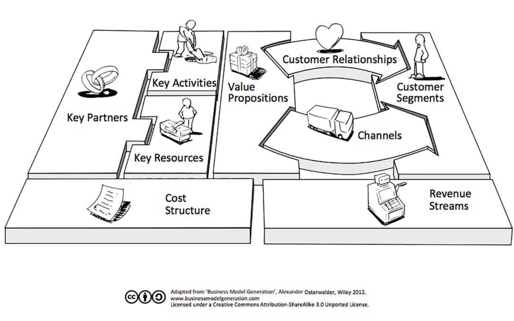
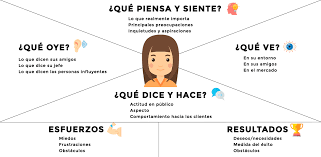
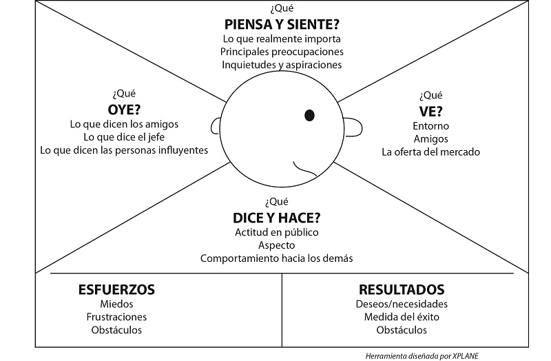

# clase 3
20-agosto

## conozcamos al cliente

herramientas útiles para conocer los clientes

labor investigativa:
- redes sociales
- seguimiento de ventas
- investigar canales de comunicación y ventas de la empresa

## business model canvas

A continuación las definiciones, en orden de cómo se rellena al investigar una empresa. De igual manera, al iniciar un nuevo negocio, este es el orden recomendado para rellenarlo.

### segmento de clientes: 

cada empresa tiene su segmento, y puede tener más de uno.

preguntas que debemos respondernos,
- ¿dirijirnos al público general o segmentar?
- ¿quiénes son los clientes de la empresa, a quién se dirige?
- ¿qué segmentos podemos identificar?
- ¿qué segmentos son prioritarios?
- ¿qué necesitan estos clientes?

#### mapa de empatía

herramienta visual que permite a la empresa, describir, diseñar, analizar y adapatar sus modelos de negocio.

busca entender a su usuario. Se usa para definir el segmento de clientes

se pueden hacer mapa de empatía por separado para cliente y usuario.

se puede incluir: cómo se viste, qué le gusta, con qué tipo de empresa le gusta trabajar, etc. 

¿qué oye en su entorno respecto a la empresa?

### propuesta de valor:

aquello que diferencia a la empresa de otras empresas similares. O aquello que agrega valor a la empresa.

objetivo: definir el valor creado para vcada segmento de clientes, describiendo los productos y servicios que se aofrecen a cada uno

preguntas guía: 
- ¿qué valor entrega el emprendimiento a su clientes?
- ¿qué aporta esta empresa a sus clientes?
- ¿qué problema de sus clientes está resolviendo?
- ¿qué necesidades de sus clientes está satisfaciendo?
- ¿qué beneficios le está aportando?
- ¿qué paquetes de productos y serivcios le ofrece a - cada segmento de clientes?

¿qué tienen en común rolex, dios y rolex?

venden status, son exclusivas, y tienen cierto poder sobre los medios.

algunos clientes pueden encontrar valor en el hecho de utilizar/mostrar una marca. El valor de la marca puede ser parte de la propuesta de valor.

### relación con los clientes:

cómo la empresa trata y se dirige hacia sus clientes. ¿cómo le comunico lo que estoy haciendo?

describe los tipos de relaciones que la empresa establece con los segmentos de clientes. Las relaciones pueden variar desde nivel personal hasta automatizado. Las relaciones con el cliente pueden ser motivadas por las siguientes motivaciones:

- la adquisición de clientes
- la retención de clientes
- aumento de las ventas

preguntas clave:

- ¿qué tipo de relación esperan los clientes de la empresa que establezca y mantenga con ellos?
- ¿cómo es la relacion q ha establecido la marca hasta ahora?
- ¿la relacion es emocional o mas bien funcional?
- ¿cuál es el "tono" de la relación?

### canales de comunicación y distribución:

definir canales: páginas web, mercado libre, rrss, counicación directa, starken, etc.

describen la manera en la q la compañía se comunica con los segmentos de clientes, y la forma en la que entrega la propuesta de valor. Busca definir las interfaces principales entre la empresa y los clientes(comunicación distribución, ventas)

preguntas clase

- ¿a través de qué canales la empresa llega a sus clientes?
- ¿a través de qupe canales entrega su propuesta de valor?
- ¿hay algún otro canal que podría seer mejor para alacanzar a los diferentes segmentos de clientes, segpun las características de cada segmento.
- ¿cóomo están integradls los canales de la empresa?
- ¿cuáles funciona mejor?

### flujos de ingreso:

¿por qué me van a pagar mis clientes? un negocio puede tener múltiples flujos de ingreso.

refiere a los sevicios, productos u otras acciones que le permiten a la empresa generar ingresos.

preguntas clave

- ¿por qué valor los clientes están dispuestos  a pagar hoy?
- ¿actualmente por qué productos /servicios están pagando?
- ¿cómo se pagan esos productos/servicios?
- ¿cuánto aporta cada fuente de ingreso a los ingresos totales?
- ¿cual es la principal fuente de igreso?
- ¿qué productos tienen un rol más estratégico(y no de plata)?

usuario vs cliente: ejemplo, para los jueguetes, el usuario es el niñx, y el cliente es la mamá o quien se lo compró.

## Calibra Gestores

no solamente hacen el feedback, también diseñan y planifican la instalación. Ayuda a generar conexiones.

### segmento de clientes

- ¿dirijirnos al público general o segmentar?
segmentar
- ¿quiénes son los clientes de la empresa, a quién se dirige?
a otras instituciones públicas y privadas
- ¿qué segmentos podemos identificar?
empresas del sector público, empresas del sector rural, empresas privadas. empresas que recolección de datos. fundaciones sin fines de lucro, ong ,etc
- ¿qué segmentos son prioritarios?
entidades públicas
- ¿qué necesitan estos clientes?
feedback, opiniones de la gente

### propuesta de valor

- ¿qué valor entrega el emprendimiento a su clientes?
entender la viabilidad/opinion popular antes un pryecto antes de que este sea implementado.
- ¿qué aporta esta empresa a sus clientes?
las opiniones de la gente, y mayor seguridad de que va a funcioanr el proyecto
- ¿qué problema de sus clientes está resolviendo?
falta de contactos o socios estratégicos
- ¿qué necesidades de sus clientes está satisfaciendo?
falta de eficiencia. (sin ellxs, aumenta la posibilidad de que un proyecto q no es realmente útil para su público)
- ¿qué beneficios le está aportando?
asegurarse de tener a la ciudadanía involucrada. Y por lo tanto, estar de acuerdo.
- ¿qué paquetes de productos y servicios le ofrece a cada segmento de clientes?
no solamente hacen el feedback, también diseñan y planifican la instalación. Ayuda a generar conexiones.

### relación con los clientes

- ¿qué tipo de relación esperan los clientes de la empresa que establezca y mantenga con ellxs?
relación a largo plazo con servicio postventa. Formal pero cercana. Generar lazos de confianza.
- ¿cómo es la relacion q ha establecido la marca hasta ahora?
de confianza, lazos interpersonales. Dado que hay alta competencia, tienen q hacer la pega bien para que los vuelvan a llamar.
- ¿la relacion es emocional o más bien funcional?
con el quien los contrata es una relación funcional, y con la gente, emocional.
- ¿cuál es el "tono" de la relación?
tono profesional, cercano, de confianza.

### canales de comunicación y distribución:

- ¿a través de qué canales la empresa llega a sus clientes?
email, linkedin, rrss, boca a boca.
- ¿a través de qué canales entrega su propuesta de valor?
sitio web, instagram.
- ¿hay algún otro canal que podría ser mejor para alcanzar a los diferentes segmentos de clientes, según las características de cada segmento?
dado que tienen claro sus clientes potenciales, pueden ir directamente a conversar con ellxs.
- ¿cómo están integrados los canales de la empresa?
contización directa desde el sitio web. En la página hay derivaciones a redes sociales, email y número telefónico
- ¿cuáles funciona mejor?
nose

### flujos de ingreso:

- ¿por qué valor los clientes están dispuestos  a pagar hoy?
la opinión de la gente
- ¿actualmente por qué productos /servicios están pagando?
crear espacios de comunicación y gestionar la información rescatada 
- ¿cómo se pagan esos productos/servicios?
por hora
- ¿cuánto aporta cada fuente de ingreso a los ingresos totales?
servicios:
1. investigación social
2. espacios de comunicación, diálogos multiactor y encuentro
3. diseño e implementación de estrategias de planificación
4. fortalecimiento del capital social.

- ¿cual es la principal fuente de ingreso?

estimamos que de ellos, la mayor fuente de ingresos es la investigación social. Contrataciones por parte del sector público
- ¿qué productos tienen un rol más estratégico(y no de plata)?

fortalecimiento del capital social: talleres educativos con comunidades.