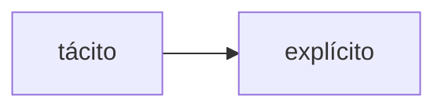

# clase 8 

## 2025-10-1

### herramientas de ideación

#### lluvia de ideas:

consiste en tirar todas las ideas posible suqe se ocurran. 

Es importante no descartar ideas que pueden parecer irreales o ineficientes.

luego puede ser útil agrupar las distintas ideas en grupos.

#### desde/hasta:

se pleantean las ideas más obvias y tbn las imposibles.

Se analizan ambos polos y se buscan maneras de reempalazar tecnologías y prescindir de presuspuestos.

Se buscan ideas centrales, que se encuentren entre medio de ambos polos.

#### crazy 8

metodología ágil que busca acelerar el proceso de ideación con la finalidad de generar voluman y no prejuiciar ideas.

- se define un límite de tiempo(usualmente 8 minutos)
- cada miembro del equipo escribe en un papel al menos 8 ideas
- luego se comparten las ideas
- se pueden categorizar las ideas y agruparlas
- luego se pueden usar filtros para llegar una idea ifnal a desarrollar

#### sketching

herramienta visual que nos permite ir creando ideas y pasarla desde el plano de las ideas al plano material

### ejercicio zoológico

grupo etario elegido: abuelos con sus nietos

- idea00
crear rutas alternativas que vayan por dentro/arriba de los hábitat. Hay una zona de obeservación con mesas y sillas.
Adultos mayores pueden sentarse a descansar, kientras tienen a la vista a sus nietxs.
[referente](https://huilohuilo.com/donde-alojar/hoteles/montana-magica)

- idea01:
juegos inspirados en los comportamientos de los animales. Instructores incitana  juegos de rol y prácticas que enseñan e informan sobre la fauna chilena.

- idea02:
ofrecer servicios de video/fotografía, alo largo de todo el recorrido. Con el fin de generar memorias y material de recuerdo. -Vínculo abuelx-nietx-

- idea03:
que funciones como un resort, la experiencia se vive a lo largo de varios días. Se abre el mercado de vacaciones.

- idea04:
gamificar la experiencia. Con una app movil, poder ir completando retos y consiguiendo recompensas.
Ejemplo, tienes que tomarle foto a todos los animales que coman insectos. Si lo logras antes de irte del parque, ganas descuentos, llaveros, etc.

- idea05:
ofrecer transportes tipo moto con sidecar para que recorrer el parque.

- idea06: 
vender la carne cruda de los animales para cocinar mmm :p

- idea07: transformarlo en una experiencia tipo "survival", donde se enseñen tácticas de supervivencia y conservación, específicas para cada espcecie.

- idea08:
hacer difusión y muestras en vivo de los procesos que no se ven habitualmente. Por ejemplo, cirugías, cuidados, adapactación del espacio. -Cursos de cuidador, veterinario, etc. Tipo kidzania-

- idea09:
hacer una evento de fortnite.

### problema 

el problema que habíamos definido es:

La inconsistencia de trabajar con proyectos a corto y mediano plazo, genera la necesidad de trabajar múltiples proyectos a la vez, cuando es posible.

soluciones: 

ideación: 

#### force fit: 
- Intensidad vacía.
- Intensidad vacacional
- inconsistencia productiva
- estabilidad impredecible

a qué se asocia este útimo concepto?
- sistema antisísmico
- alarma/protocolo daisy
- protocolo metro para personas en las vías
- frecuencia micros

que podémos rescatar de estos fenómenos?
- sistema antisísmico: se aplican estrategias fijas. No importa si va a temblar o no, está ahí porsiacaso.

idea: generar protocolo de cómo tratar la sobrecarga. Tener una plantilla fija reducida, y subcontratar en casos de mucha carga laboral.

de qué depende esta demanda estacional?
- proyectos en el verano.
- previo a períodos electorales.
- profe agustina: el 2do semestre se activa más, pq los pruyectos tienen q ver con fondos públicos. entidades publicas. El 2do semestre piensas "se va a acabar el año hay q cerrar el año bien"

- están en el valle de la muerte apun, por mucho tiempo sobrevivieron con n°s rojos, con pretamos. actualmente han logrado estar en pto de equilibrio, aun teninedo esta estacionalidad en las ventas e ingresos. hace aprox 3-4 años q pasa esto. ¿cómo lograr estabilidad en las ventas?

- entendiendo el flujo de ingresos podríamos "equilibrar" los costos.

- este año están gestionando una patente como productora, para ampliar su línea de negocios. quizas tiene  q ver con implementar lo q se diseñó.

- en el pasado hacían una revista comunal, costaba muxa plata.