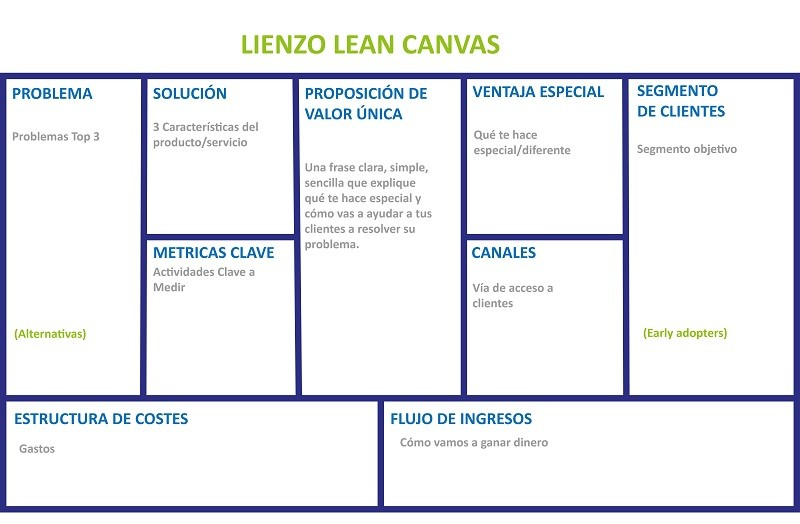

# clase 9

## 08-sept-2025

### lean canvas

### propósito de esta clase

materializar y testear ideas.

1. materializar ideas: desarrollar un producto / servicio
2. validar: cómo obtener retroalimentación real
3. acelerar el aprendizaje: reducir riesgos y maximizar potencial

#### no todas las ideas son buenas

factores de una idea no buena:

- plata
- satisfacción de las necesidades del usuarie
- tecnología

el prototipado nos ayuda a identificar las ideas buenas.

### iteración

iterar es la acción de "volver atrás". Para redefinir ideas u objetivos.

## ¿qué es un prototipo?

- representación física simplificada
- no busca perfección , sino, respuesta rápidas
- permite aprender qué funciona y que no, antes de invertir más recursos
- permite obtener opiniones
- reduce riesgos

a traves de una representación fisica, buscamos obtener retroalimentación , para encontrar aprendizajes.

### tipos de prototipo

#### baja fidelidad

- bocetos maquetas, relatos, roleplay, etc.
- dibujos, maquetas de papel o cartón
- rápidos de crear
- ideas para validar conceptos iniciales

#### media fidelidad

- maquetas físicas o digitales sin funcionalidad completa
- representaciones estrucutradas y detalladas del producto
- incluye algunas funcionalidades y detalles

#### prototipo de alta fidealidad

- prototipos funconales, MVP's(Minimum Viable Product), simulaciones.
- versiones cercanas al producto final
- permiten probar la experiencia del usuario

### tareas hoy en clase

- Lean Canvas
- plan de testeo

#### plan de testeo

1. Identificar usuarios: selecciona 5 a 7 personas que representen a tus clientes ideales
2. diseñar entrevistas: define preguntas
3. crear tareas: define las acciones concretas que el usuario debe realizar
4. documentar resultados: registra las respuestas, observaciones y sugerencias
5. iterar: mejora tu prototipo basado en la retroalimentación

#### para testear

define:

- ¿qué queremos aprender o validar?
- ¿qué supuestos son más riesgosos?
- ¿qué no sabemos aún?

selecciona un tipo:

- si queremos testear comprensión o interés: baja fidelidad
- si queremos testear uso o experiencia: media o alta fidelidad

### MVP: producto mínmo viable

- suficiente para recibir feedback
- permite cotizar y manejar costos aproximados
- **NO es el producto final**

#### consejos para errores comunes

- evitar sobre exigecia del prototipo
- gasta poco dinero en los primeros intentos
- validar con usuarios reales
- documenta bien todo el proceso de testeo
