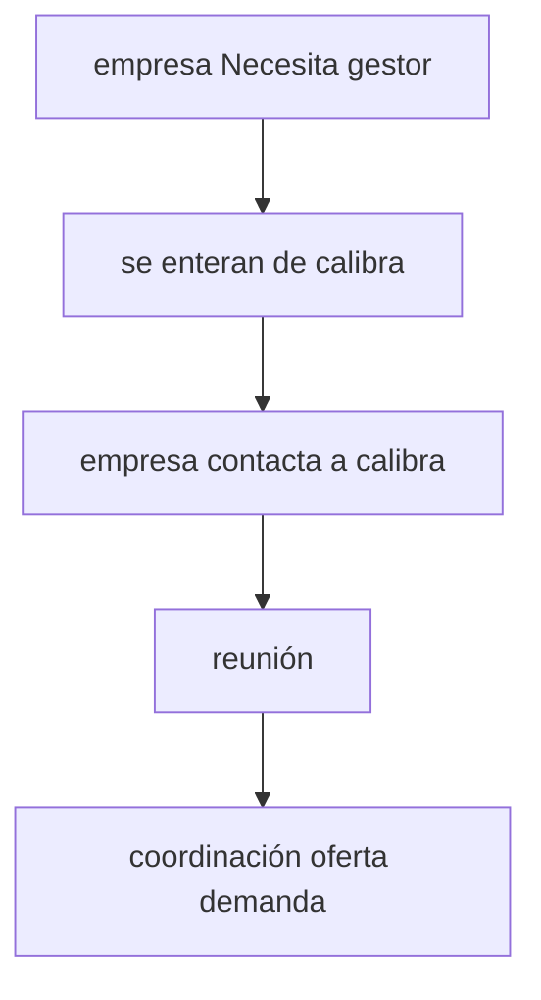

# reunión con gabriela

## apuntes

preguntas:

- flujo de usuario
- journey map
- comporbar info que tenemos
- corroborar problemaitca
- tiempos de sequía
- demografica casi totalmente adulta

- comprobar/confirmar: todo el BMC

### correo

incluir:

- BMC
- problematica identificada
- estructura de costos

mandar BMC y pedirle q le eche un ojo. Para conversarlo en la reu.

## Calibra Gestores

BUSINESS MODEL CANVAS

### Socios claves

Universidades (facultades de sociología, antropología, psicología, economía, ciencia política).
Ministerios y servicios gubernamentales.
Prensa escrita, radio, TV, medios digitales.
Empresas de software para análisis de datos

### Actividades clave

Determinar líneas de investigación prioritarias
Creación de la organización/empresa, inscripción legal, cumplimiento de normativas y permisos.
Implementar software para análisis de datos.
Recursos claves: equipo/ trabajadores de alto rendimiento los cuales se especializan
red de contactos
La capital inicial solicitado para el desarrollo inicial del proyecto.

### Propuesta de valor

Entender la viabilidad/opinión popular antes un proyecto antes de que este sea implementado.
Transparencia y acompañamiento personalizado.las opiniones de la gente, y mayor seguridad de que va a funcionar el proyecto.

### Canales

Comunicación:Página web (calibragestores.cl).
Contacto directo vía ejecutivos.
Redes sociales
Reuniones presenciales y virtuales con clientes.

### Relacion con clientes

Emocional: Confianza basada en transparencia. Acompañamiento cercano y personalizado. 
Funcional: Relación profesional medio de reuniones presenciales y/o virtuales.

### Estructura de costos

Son los diferentes gastos  que tiene la empresa para que funcione siendo la base los costos  Fijo siendo estos los sueldos de empleados ,infraestructura, equipamiento.
Variable: Remuneraciones del equipos multidisciplinarios, transporte.
de campo: viaje y estadía.
difunción: producción de documentos , infografías, publicaciones.

### Fuente de ingresos

Talleres, planificación, acompañamiento.

### Segmentos de clientes

Entidades gubernamentales y empresas privadas.

### flujo de usuario

